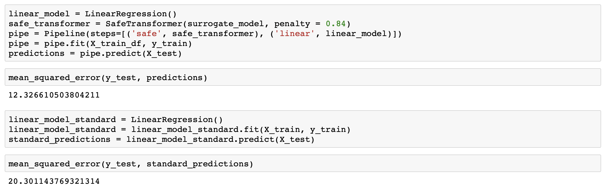
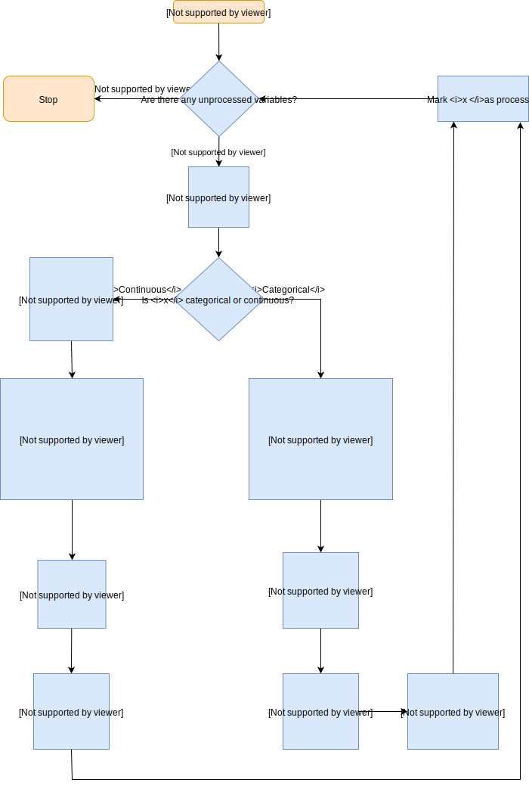
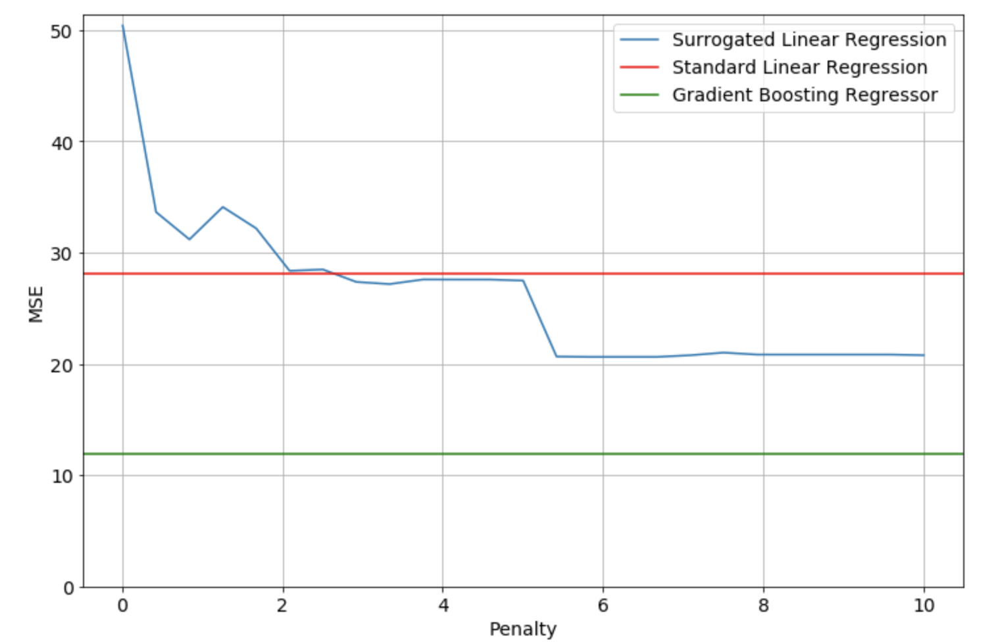

# SAFE - Surrogate Assisted Feature Extraction

SAFE is a python library that you can use to enhance your simple ML models.
The idea is to use more complicated model - called surrogate model - to extract more information from features, which can be used later to fit some simpler model.
Input data is divided into subsets, determined by surrogate model, and then it is transformed  based on the subset each point belonged to.
Library provides you with SafeTransformer class, which implements TransformerMixin interface, so it can be used as a part of the scikit-learn pipeline.


## Requirements

To install this library run:

```
pip install safe-transformer
```

The only requirement is to have Python 3 installed on your machine.

## Usage with example

Sample code using SAFE transformer as part of scikit-learn pipeline:

&nbsp;&nbsp;

&nbsp;&nbsp;

As you can see you can improve your simple model performance with help of the more complicated model.

You can use any model you like, as long as it has fit and predict methods in case of regression, or fit and predict_proba in case of classification. Data used to fit SAFE transformer needs to be pandas data frame. 

You can also specify penalty and pelt model arguments.

In examples folder you can find jupyter notebooks with complete classification and regression examples.

## Algorithm

Our goal is to divide each feature into subsets and then transform feature values based on the subset they belong to. 
The division is based on the response of the surrogate model. 
In case of continuous dependent variables for each of them we find changepoints - points that indicate values of variable for which the response of the surrogate model changes quickly. Intervals between changepoints are the basis of the transformation, eg. feature is transformed to categorical variable, where feature values in the same interval form the same category. To find changepoints we need partial dependence plots. 
These plots are graphical visualizations of the marginal effect of a given variable (or multiple variables) on an outcome of the model.
In case of categorical variables for each of them we perform hierarchical clustering based on surrogate model responses.


Algorithm for performing fit method is illustrated below:

&nbsp;&nbsp;



&nbsp;&nbsp;


Here is example of partial dependence plot. It was created for boston housing data frame, variable in example is LSTAT. To get changepoints from partial dependence plots we use ruptures library and its model Pelt.

| | |
| - | - |
|  |  |

Our algorithm works both for regression and classification problems. In case of regression we simply use model response for creating partial dependence plot and hierarchical clustering. As for classification we use predicted probabilities of each class.

## Model optimization

One of the parameters you can specify is penalty - it has an impact on the number of changepoints that will be created. Here you can see how the quality of the model changese with penalty. For reference results of surrogate and basic model are also in the plot.

&nbsp;&nbsp;

&nbsp;&nbsp;

With correctly chosen penalty your simple model can achieve much better accuracy, close to accuracy of surrogate model.

## References

* [Original Safe algorithm](https://mi2datalab.github.io/SAFE/index.html), implemented in R 
* [ruptures library](https://github.com/deepcharles/ruptures), used for finding changepoints
* [kneed library](https://github.com/arvkevi/kneed), used for cutting hierarchical tree 

