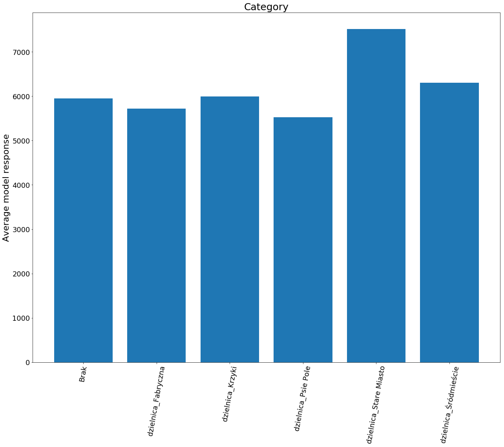

# SAFE - Surrogate Assisted Feature Extraction

SAFE is a python library that you can use to build better explainable ML models leveraging capabilities of more powerful, black-box models. 
The idea is to use more complicated model - called surrogate model - to extract more information from features, which can be used later to fit some simpler but explainable model.
Input data is divided into intervals or new set of categories, determined by surrogate model, and then it is transformed based on the interval or category each point belonged to.
Library provides you with SafeTransformer class, which implements TransformerMixin interface, so it can be used as a part of the scikit-learn pipeline.
Using this library you can boost simple ML models, by transferring informations from more complicated models.

## Requirements

To install this library run:

```
pip install safe-transformer
```

The only requirement is to have Python 3 installed on your machine.

## Usage with example

Sample code using SAFE transformer as part of scikit-learn pipeline:

```python
from SafeTransformer import SafeTransformer
from sklearn.datasets import load_boston
from sklearn.ensemble import GradientBoostingRegressor
from sklearn.model_selection import train_test_split
import pandas as pd
from sklearn.linear_model import LinearRegression
from sklearn.metrics import mean_squared_error
from sklearn.pipeline import Pipeline

data = load_boston()
X = pd.DataFrame(data.data, columns=data.feature_names)
y = data['target']

X_train, X_test, y_train, y_test = train_test_split(X, y)

surrogate_model = GradientBoostingRegressor(n_estimators=100,
    max_depth=4,
    learning_rate=0.1,
    loss='huber')
surrogate_model = surrogate_model.fit(X_train, y_train)

linear_model = LinearRegression()
safe_transformer = SafeTransformer(surrogate_model, penalty = 0.84)
pipe = Pipeline(steps=[('safe', safe_transformer), ('linear', linear_model)])
pipe = pipe.fit(X_train, y_train)
predictions = pipe.predict(X_test)
mean_squared_error(y_test, predictions)

```

```bash
13.617733207161479
```

```python
linear_model_standard = LinearRegression()
linear_model_standard = linear_model_standard.fit(X_train, y_train)
standard_predictions = linear_model_standard.predict(X_test)
mean_squared_error(y_test, standard_predictions)
```

```bash
29.27790566931337
```

As you can see you can improve your simple model performance with help of the more powerful, black-box model, keeping the interpretability of the simple model.

You can use any model you like, as long as it has fit and predict methods in case of regression, or fit and predict_proba in case of classification. Data used to fit SAFE transformer needs to be pandas data frame. 

You can also specify penalty and pelt model arguments.

In [examples folder](https://github.com/olagacek/SAFE/tree/master/examples) you can find jupyter notebooks with complete classification and regression examples.

## Algorithm

Our goal is to divide each feature into intervals or new categories and then transform feature values based on the subset they belonged to. 
The division is based on the response of the surrogate model. 
In case of continuous dependent variables for each of them we find changepoints - points that indicate values of variable for which the response of the surrogate model changes quickly. Intervals between changepoints are the basis of the transformation, eg. feature is transformed to categorical variable, where feature values in the same interval form the same category. To find changepoints we need partial dependence plots. 
These plots describe the marginal effect of a given variable (or multiple variables) on an outcome of the model.
In case of categorical variables for each of them we perform hierarchical clustering based on surrogate model responses. Then, based on the biggest similarity in response between categories, they are merged together forming new categories.


Algorithm for performing fit method is illustrated below:

&nbsp;&nbsp;


&nbsp;&nbsp;

Our algorithm works both for regression and classification problems. In case of regression we simply use model response for creating partial dependence plot and hierarchical clustering. As for classification we use predicted probabilities of each class.

### Continuous variable transformation

Here is example of partial dependence plot. It was created for boston housing data frame, variable in example is LSTAT. To get changepoints from partial dependence plots we use [ruptures](http://ctruong.perso.math.cnrs.fr/ruptures-docs/build/html/index.html) library and its model [Pelt](http://ctruong.perso.math.cnrs.fr/ruptures-docs/build/html/detection/pelt.html).

  

### Categorical variable transformation

In the plot below there is illustarted categorical variable transformation. To create new categories, based on the average model responses, we use scikit-learn [ward algorithm](https://scikit-learn.org/0.15/modules/generated/sklearn.cluster.Ward.html) and to find number of clusters to cut KneeLocator class from [kneed library](https://github.com/arvkevi/kneed) is used.

  

## Model optimization

One of the parameters you can specify is penalty - it has an impact on the number of changepoints that will be created. Here you can see how the quality of the model changese with penalty. For reference results of surrogate and basic model are also in the plot.

&nbsp;&nbsp;

&nbsp;&nbsp;

With correctly chosen penalty your simple model can achieve much better accuracy, close to accuracy of surrogate model.

## Variables transformation

If you are interested in how your dataset was changed you can check summary method. 

```python
safe_transformer.summary(variable_name='CRIM')
```

```
Numerical Variable CRIM
Selected intervals:
	[-Inf, 4.90)
	[4.90, 11.14)
	[11.14, 15.59)
	[15.59, 24.50)
	[24.50, 33.40)
	[33.40, 48.54)
	[48.54, Inf)
```

To see transformations of all the variables do not specify variable_name argument.

```python
safe_transformer.summary()
```

```
Numerical Variable CRIM
Selected intervals:
	[-Inf, 4.90)
	[4.90, 11.14)
	[11.14, 15.59)
	[15.59, 24.50)
	[24.50, 33.40)
	[33.40, 48.54)
	[48.54, Inf)
Numerical Variable ZN
Selected intervals:
	[-Inf, 33.53)
	[33.53, Inf)
Numerical Variable INDUS
Selected intervals:
	[-Inf, 2.78)
	[2.78, 3.19)
	[3.19, 4.28)
	[4.28, 10.29)
	[10.29, 26.68)
	[26.68, Inf)
Numerical Variable CHAS
Selected intervals:
	[-Inf, Inf)
Numerical Variable NOX
Selected intervals:
	[-Inf, 0.52)
	[0.52, 0.60)
	[0.60, 0.67)
	[0.67, 0.68)
	[0.68, 0.70)
	[0.70, 0.76)
	[0.76, 0.82)
	[0.82, Inf)
Numerical Variable RM
Selected intervals:
	[-Inf, 4.27)
	[4.27, 4.76)
	[4.76, 5.10)
	[5.10, 5.42)
	[5.42, 5.78)
	[5.78, 6.09)
	[6.09, 6.36)
	[6.36, 6.54)
	[6.54, 6.64)
	[6.64, 6.75)
	[6.75, 6.85)
	[6.85, 7.09)
	[7.09, 7.14)
	[7.14, 7.43)
	[7.43, 7.45)
	[7.45, 7.79)
	[7.79, 7.82)
	[7.82, 7.84)
	[7.84, 8.03)
	[8.03, Inf)
Numerical Variable AGE
Selected intervals:
	[-Inf, 4.36)
	[4.36, 6.30)
	[6.30, 34.00)
	[34.00, 45.18)
	[45.18, 58.30)
	[58.30, 66.56)
	[66.56, 69.48)
	[69.48, 83.09)
	[83.09, 98.15)
	[98.15, Inf)
Numerical Variable DIS
Selected intervals:
	[-Inf, 1.22)
	[1.22, 1.28)
	[1.28, 1.33)
	[1.33, 1.44)
	[1.44, 1.50)
	[1.50, 1.55)
	[1.55, 2.10)
	[2.10, 3.09)
	[3.09, 3.75)
	[3.75, 4.19)
	[4.19, 5.61)
	[5.61, 6.16)
	[6.16, 7.80)
	[7.80, Inf)
Numerical Variable RAD
Selected intervals:
	[-Inf, 1.46)
	[1.46, 4.57)
	[4.57, 15.96)
	[15.96, Inf)
Numerical Variable TAX
Selected intervals:
	[-Inf, 207.98)
	[207.98, 221.09)
	[221.09, 278.79)
	[278.79, 412.55)
	[412.55, 551.54)
	[551.54, 687.92)
	[687.92, Inf)
Numerical Variable PTRATIO
Selected intervals:
	[-Inf, 13.82)
	[13.82, 13.87)
	[13.87, 14.76)
	[14.76, 17.73)
	[17.73, 19.42)
	[19.42, 19.66)
	[19.66, 20.97)
	[20.97, Inf)
Numerical Variable B
Selected intervals:
	[-Inf, 30.09)
	[30.09, 105.52)
	[105.52, 115.44)
	[115.44, 292.10)
	[292.10, 304.01)
	[304.01, 361.57)
	[361.57, 377.45)
	[377.45, Inf)
Numerical Variable LSTAT
Selected intervals:
	[-Inf, 4.55)
	[4.55, 4.73)
	[4.73, 5.43)
	[5.43, 5.96)
	[5.96, 7.55)
	[7.55, 8.08)
	[8.08, 9.67)
	[9.67, 9.85)
	[9.85, 10.02)
	[10.02, 14.43)
	[14.43, 14.96)
	[14.96, 16.02)
	[16.02, 18.14)
	[18.14, 19.37)
	[19.37, 23.96)
	[23.96, 26.78)
	[26.78, 29.61)
	[29.61, Inf)
```
## References

* [Original Safe algorithm](https://mi2datalab.github.io/SAFE/index.html), implemented in R 
* [ruptures library](https://github.com/deepcharles/ruptures), used for finding changepoints
* [kneed library](https://github.com/arvkevi/kneed), used for cutting hierarchical tree 

