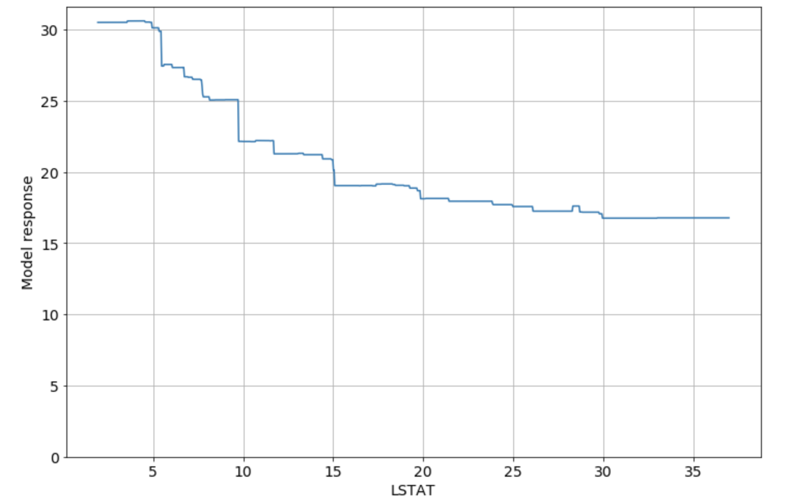
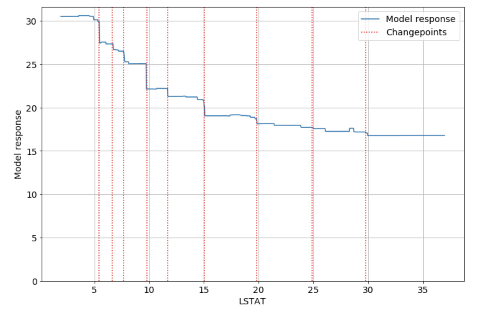

# SAFE - Surrogate Assisted Feature Extraction

SAFE is a python library that you can use to enhance your simple ML models.
The idea is to use more complicated model - called surrogate model - to extract more information from features, which can be used later to fit some simpler model.
Input data is divided into subsets, determined by surrogate model, and then it is transformed  based on the subset each point belonged to.
Library provides you with SafeTransformer class, which implements TransformerMixin interface, so it can be used as a part of the scikit-learn pipeline.


## Requirements

To install this library run:

```
pip install safe-transformer
```

The only requirement is to have Python 3 installed on your machine.

## Usage with example

```python
safe_transformer = SafeTransformer()

safe_transformer = safe_transformer.fit(X_train, surrogate_model, penalty = pen)

X_train_transformed = safe_transformer.transform(X_train)

X_test_transformed = safe_transformer.transform(X_test)

linear_model_transformed = LinearRegression()

linear_model_transformed = linear_model_transformed.fit(X_train_transformed, y_train)

```

You can also use this trsnsformer as part of scikit-learn pipeline. 

As you can see you can improve your simple model performance with help of the more complicated model.

Depending on the penalty attribute you can achieve different results.


With correctly chosen penalty your simple model can achieve much better accuracy, close to accuracy of surrogate model.

## Algorithm

Our goal is to divide each feature into subsets and then transform feature values based on the subset they belong to. 
The division is based on the response of the surrogate model. 
In case of continuous dependent variables for each of them we find changepoints - points that indicate values of variable for which the response of the surrogate model changes quickly. Intervals between changepoints are the basis of the transformation, eg. feature is transformed to categorical variable, where feature values in the same interval form the same category. To find changepoints we need partial dependence plots. 
These plots are graphical visualizations of the marginal effect of a given variable (or multiple variables) on an outcome of the model.

Algorithm for creating partial dependence plot for single variable var:

1. Create linspace from minimal value of var to maximal value of var
2. For each value from linspace named val:
* Replace all values of var in original data with val, keeping the rest of variables as they were
* Get surrogate model response for each of newly created vectors, and save mean of these responses with val associated with it
3. Partial dependence plot is created from vals in linspace and corresponiding mean of responses 

Here is example of partial dependence plot. It was created for boston housing data frame, variable in example is LSTAT.



To get changepoints from partial dependence plots we use ruptures library and its model Pelt.

This is partial dependence plot with changepoints on it:




